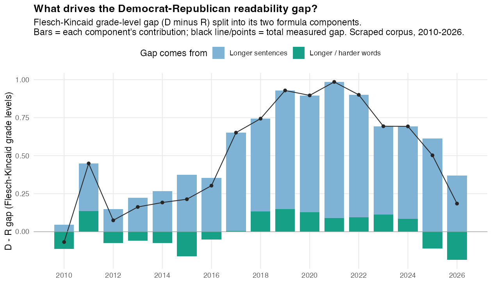
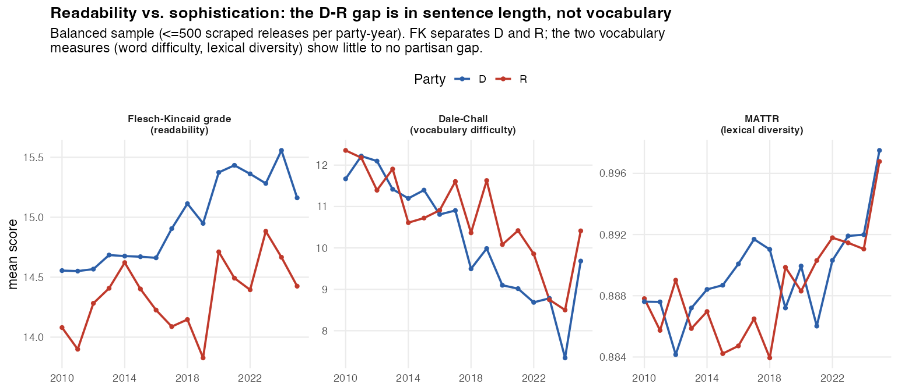
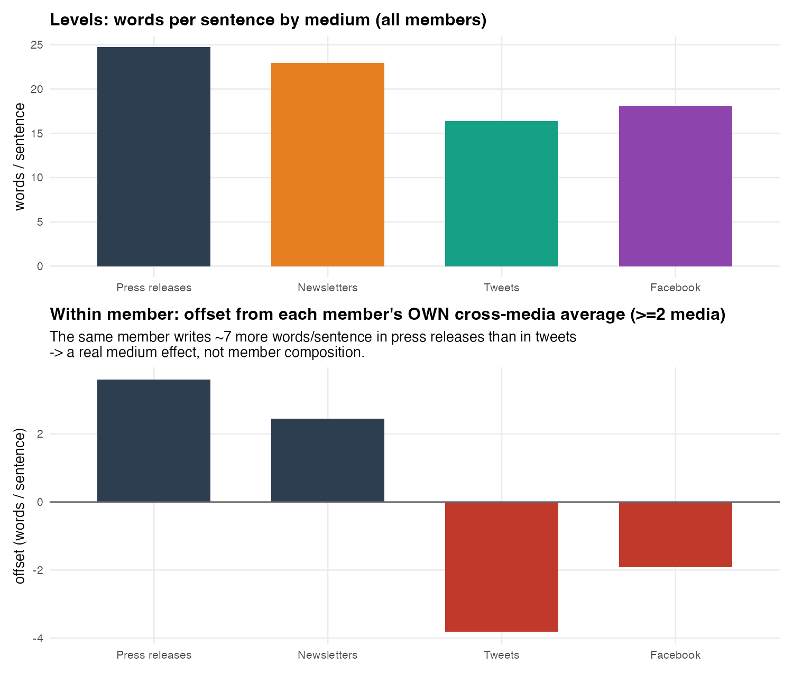
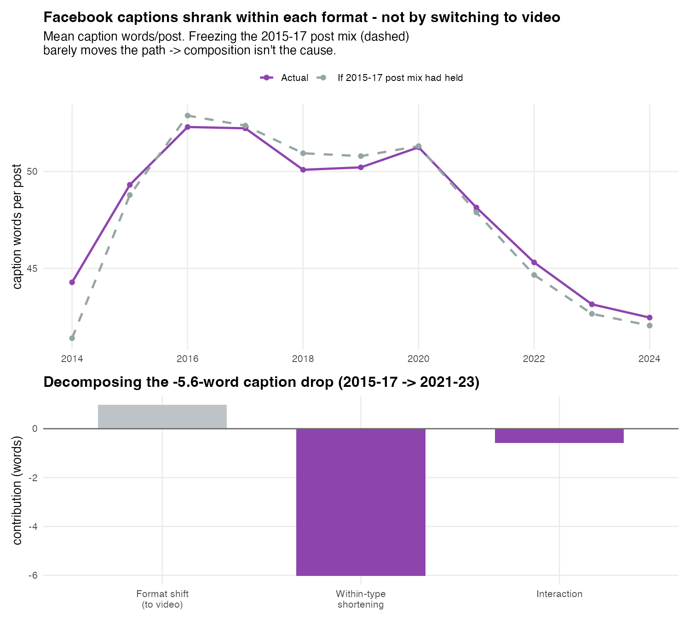

# Democrats don't write more sophisticated press releases. They write longer sentences.

*Draft (v2) — analysis and figures are reproducible from `blog/analysis/`; data notes and caveats at the end.*

Every so often someone runs a readability score over politicians' words and discovers a
partisan gap: one party, usually the Democrats, comes out writing at a higher "grade level."
It's an irresistible headline — *one side is talking over voters' heads* — and the numbers
look authoritative. Flesch-Kincaid grade level! Measured! Rising!

I pulled ~436,000 congressional press releases (2010–2025), scored them, and found the same
gap. Then I took it apart. The gap is real, it's grown, and it has almost nothing to do with
sophistication — at least not the kind you'd measure with vocabulary. It's sentence length.
Once you see that, a lot of "the parties communicate differently" findings turn into "one
party writes longer sentences."

## The gap is real and it has roughly tripled

Score each release with Flesch-Kincaid and average by party and year, and Democratic releases
read about 0.8 grade levels "harder" than Republican ones across recent years — up from about
0.25 a decade ago (the gap peaked near 1.0 around 2021 and has eased a bit since, so read "0.8"
as the post-2018 average, not the latest single year). A real, growing partisan gap.

The trouble is what Flesch-Kincaid actually is. It isn't a measure of ideas, vocabulary, or
rigor. It's a fixed formula with two inputs:

```
FK grade ≈ 0.39 × (words per sentence) + 11.8 × (syllables per word) − 15.59
```

That's it. Because the formula is additive, the gap between two groups is *exactly* the sum of
a sentence-length term and a word-length term — so you can ask which one carries it.



In the chart, the blue bars are the sentence-length contribution and the green bars the
word-length contribution to the D–R gap each year; the black markers are the total gap, and
their climb is the "tripling." Of that gap — which by construction is just those two terms —
**99% sits on the sentence-length term and about 1% on word length.** Democrats don't use
rarer or longer words than Republicans; they put more words between full stops. The whole
"sophistication gap," and its growth over a decade, is a sentence-length gap wearing a
grade-level costume.

## When you measure vocabulary directly, the gap doesn't follow

If this were really about sophistication, it should show up in measures that actually weigh
words. So I scored the same releases two more ways. **MATTR** is a length-robust measure of
lexical *diversity* — how varied the vocabulary is — and it's the closest thing here to a pure
vocabulary measure. **Dale-Chall** scores how many words fall outside a list of ~3,000
everyday words; note that it isn't pure vocabulary either — it blends that difficult-word rate
*with* average sentence length (`≈ 64 − 0.95·%difficult − 0.69·words-per-sentence`). That makes
it a stiff test for the sophistication story: Dale-Chall has sentence length baked in, so if
anything it should *flatter* the longer-sentence party.



In the left panel the blue (D) and red (R) Flesch-Kincaid lines pull apart; in the middle and
right panels they sit on top of each other. Lexical diversity (MATTR) is flat across the aisle.
And on Dale-Chall — sentence length and all — Republicans actually score *harder*-worded in
recent years, not Democrats. The parties reach for the same words with the same variety; the
one index that splits them is the one driven by sentence length.

This is the spirit of Benoit, Munger, and Spirling's 2019 critique (AJPS): classic readability
indices are atheoretical, were calibrated on grade-school reading comprehension, and end up
treating "long sentence" as "hard" — a poor proxy for political sophistication. Here it isn't a
hypothetical; it's the whole effect.

## It's not a press-release quirk — it shows up wherever members write

Maybe press releases are special: a house style, a comms shop, a template. So I checked three
other channels the same members use — official **e-newsletters**, **tweets**, and **Facebook**
posts — over a common recent window. The Democratic-minus-Republican gap in words per sentence
is positive in all four:

| Medium | D − R words per sentence |
|---|---|
| Press releases | **+1.96** |
| Newsletters | +1.37 |
| Tweets | +0.84 |
| Facebook | +0.57 |

*(2019–2023; Facebook 2019–2022. Differences of yearly group means; no error bars, so read the
magnitudes as descriptive.)*

The gap is largest in long-form channels and smallest in length-capped social posts — broadly
consistent with format room mattering, though with only four media and no error bars that
ordering is suggestive, not proven. The direction, though, is the same everywhere. (One trap:
scored raw, tweets briefly suggest Republicans write "harder," but that's a tokenization
artifact — hashtags and URLs read as long, many-syllable "words." Strip them and the flip
vanishes.)

## And it's the same people, not different rosters

A skeptic's reply: maybe each channel is written by a different mix of members, and the gap is
just composition. So I matched members across channels by BioGuide ID and asked a within-person
question: does the *same* member write longer sentences in a press release than in a tweet?

Across 617 members who appear in at least two channels (180 appear in all four), the answer is
emphatic. In raw terms members average ~25 words per sentence in press releases versus ~16 in
tweets (top panel below); netting out each member's *own* cross-channel average (bottom panel):



The same person runs about **+3.6 words per sentence in press releases and −3.8 in tweets** — a
~7-word swing that isn't explained by *who* is writing. (Holding the author fixed still can't
separate the medium itself from what members choose to say where — but it rules out
composition.) And the partisan gap barely moves when you restrict to this shared roster (press
releases 1.68 → 1.71, newsletters 0.39 → 0.47, tweets 0.74 → 0.71, Facebook 0.46 → 0.47) — so
the gap isn't a roster artifact either, though only the press-release gap (~1.7 words) is large;
the others are under half a word and correspondingly uncertain.

So there are two separable things: a **medium effect** (everyone compresses on Twitter) layered
on a **partisan effect** (Democrats run a little longer at every length). Sentence length even
carries a weak-to-moderate personal-style signal — a member's average sentence length correlates
r ≈ 0.27–0.39 across channels (on as few as ~190 matched members for some pairs), i.e. some
individual consistency, far from deterministic. *(These member-level gaps are computed on the
shared roster and as deviations from each member's own average, which is why they differ from
the channel-wide table above.)*

## A detour that corrected me (the honest part)

While poking at Facebook, I noticed its posts have been getting shorter and simpler over time,
and I assumed the obvious cause: the platform shifted to video, and video posts have short
captions. Tidy story. Wrong story.

Decomposing the ~5.6-word drop in average caption length (2015–17 vs 2021–23) into "the post
mix shifted" versus "each format got shorter":



**Essentially all of the shrinkage is within-format** — link posts, status posts, and video
captions all got shorter on their own; the composition shift, if anything, pushed the other way
(long-caption text posts grew as a share). Video never even took over; it plateaued around 14%
of posts. Members didn't get terser because they switched to video — they got terser, period.
Reach, separately, fell sharply: in this CrowdTangle sample the median congressional video went
from ~2,850 observed views (2017) to ~250 (2024). (CrowdTangle was wound down over this window,
so part of that drop is likely measurement, not just reach — but the shortening result doesn't
depend on it.) I'm keeping the wrong guess in here because the decomposition that killed it is
the same tool that powers the headline result — it's worth seeing it cut both ways.

## Why it matters

"Readability" scores are everywhere — in coverage of campaigns, in content audits, in claims
about who's dumbing down or talking up. But the most popular one, Flesch-Kincaid, leans heavily
on sentence length for most prose, and in congressional text the partisan gap rides on it
entirely. The "sophistication gap," its decade-long rise, and its appearance across every medium
are one underlying fact: **Democrats write somewhat longer sentences.** That's a genuine,
consistent, cross-channel stylistic difference — just not the one a grade-level number implies.
Whether longer sentences are better, worse, or merely different is a real question. "Higher
reading level" — at least as vocabulary difficulty and lexical diversity would define
sophistication — is not the answer to it.

---

### Data & caveats

- **Corpus.** ~436,000 scraped U.S. House and Senate press releases (the full archive; ~411k
  fall in 2010–2025), plus members' e-newsletters, tweets (2017–2023), and CrowdTangle Facebook
  posts (2014–2024) for the cross-channel comparisons. Members are linked across sources via
  BioGuide ID (press releases by name + state; Facebook via ICPSR; tweets via handle).
- **What's a "gap" here.** These are differences of group means on per-document scores; I have
  not attached confidence intervals or clustered standard errors, so read magnitudes as
  descriptive. Directions are robust — the sentence-length result reproduces across deterministic
  samples and appears in four different media.
- **Social-media text** was cleaned before scoring (URLs, @-mentions, and #-hashtags stripped;
  retweets dropped; tweet days sampled), which is what removes the raw-tweet "R harder" artifact.
- **Facebook** views are a raw, unweighted CrowdTangle metric from a platform that was being
  retired over the sample, and the cross-channel Facebook series runs 2019–2022 (not 2023).
- **Roster survivorship.** The scraped archive comes from current member websites, so former
  members' pages thin out over time; the cross-channel folds and within-member controls are
  partly there to guard against that composition bias.
- **Independents** (Sanders, King, etc.) are excluded from the partisan comparisons.
- **Facebook party** is decoded from a 0/1 dummy and verified against DW-NOMINATE (Democrats'
  mean first dimension −0.37, Republicans +0.52) before use.
- Every figure and number above regenerates from the scripts in `blog/analysis/`.
